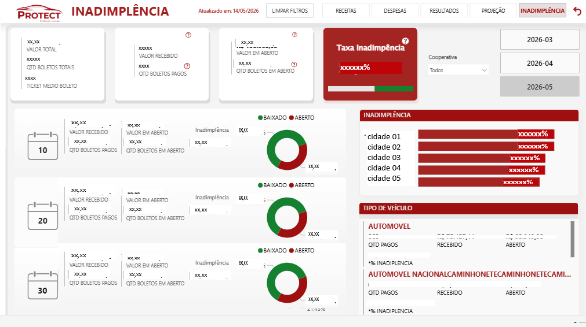
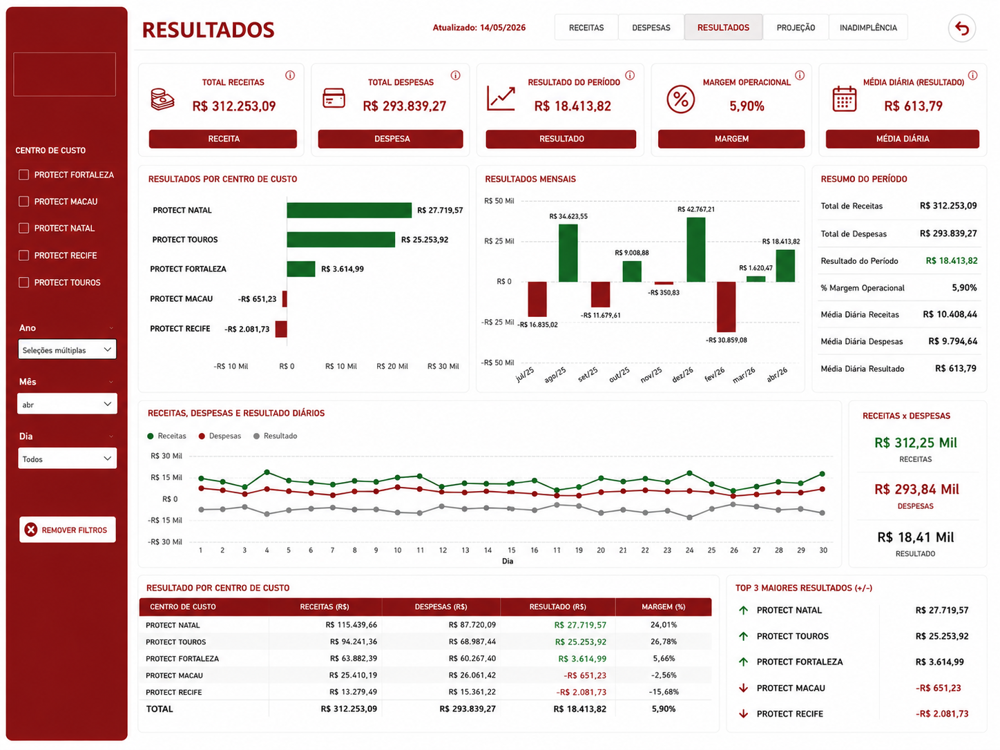
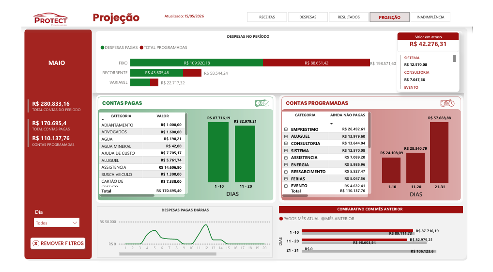
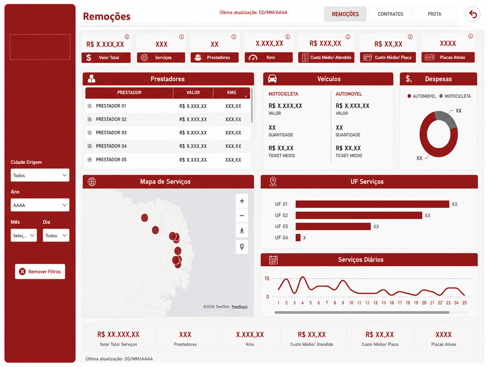

# BI Associação — Financeiro & Comercial

Dois dashboards complementares para gestão completa de uma associação de proteção veicular: visão financeira (receitas, despesas, resultado, inadimplência) e visão comercial (remoções, contratos, frota e participação de mercado).

**Stack:** Power BI · DAX · Power Query (M) · Python  
**Atualização:** Sob demanda + automação Python  
**Audiência:** Diretoria e gestores da associação  

---

## O problema

A associação operava sem visão consolidada de receitas, despesas e inadimplência. Os dados vinham de fontes diferentes, com lógicas distintas, sem cruzamento. Não havia sistema de alocação de custos entre centros — tudo era calculado manualmente.

No comercial, dados de remoções, contratos e frota existiam em sistemas separados, sem visão integrada de participação de mercado por cidade.

---

## Pipeline de dados

```
Sistema legado (relatórios HTML)
    ↓
Python — conversor HTML → CSV/XLSX (BeautifulSoup)
    ↓
Python — extrator de inadimplência (pdfplumber)
    ↓
Power Query M (limpeza e modelagem)
    ↓
Power BI (modelo tabular + DAX)
    ↓
2 dashboards — Financeiro e Comercial
```

> O pipeline começa em Python. Os relatórios do sistema legado chegam em HTML — o conversor transforma em XLSX antes de entrar no Power BI. A inadimplência vem em PDF e é extraída automaticamente.

---

## Dashboard Financeiro

### Abas

| Aba | O que mostra |
|---|---|
| Receitas | Total, por forma de pagamento (boleto, PIX, QR Code), série temporal diária |
| Despesas | Total, por centro de custo, por modalidade (fixo/recorrente/variável), série temporal |
| Resultados | Resultado líquido, margem operacional, resultado por centro de custo, série mensal |
| Projeção | Contas a pagar do mês vigente, projeção de despesas fixas |
| Inadimplência | Taxa, valor em aberto, recuperação, breakdown por centro e tipo de veículo |

### Arquitetura do modelo

**Tabelas fato:**

| Tabela | Fonte | Descrição |
|---|---|---|
| `RECEITAS` | Python → Excel | Lançamentos de receita com forma de pagamento e centro de custo |
| `DESPESA` | Python → Excel | Lançamentos de despesa com categoria e modalidade |
| `INADIMPLENCIA` | pdfplumber → Excel | Boletos em aberto com vencimento original |
| `CONTAS VIGENTES` | Excel | Projeção de contas a pagar |

**Tabelas dimensão:**

| Tabela | Descrição |
|---|---|
| `DIM_CENTRO DE CUSTO` | Centros: Administrativo / Operacional / Comercial |
| `CATEGORIAS` | Categorias de despesa |
| `CALENDARIO` | Tabela mestra de datas |

26 relacionamentos — todos Many-to-One, OneDirection.

---

### Sistema de Rateio Proporcional de Custos

A lógica mais complexa do modelo. Despesas classificadas como "gerais" (compartilhadas entre centros) são distribuídas proporcionalmente — cada centro absorve a fatia que corresponde à sua participação na receita total do período.

**Fórmula:**

```
Despesa Rateada (Centro X) = Despesa Geral Total × (Receita Centro X / Receita Total)
```

**Implementação DAX:**

```dax
-- Proporção de cada centro na receita total
Proporção Receita Mensal =
VAR ReceitaCentroMes = SUM(RECEITAS[Valor total recebido da parcela (R$)])
VAR ReceitaTotalMes =
    CALCULATE(
        SUM(RECEITAS[Valor total recebido da parcela (R$)]),
        ALLSELECTED(RECEITAS)
    )
RETURN DIVIDE(ReceitaCentroMes, ReceitaTotalMes)
```

```dax
-- Aplica a proporção às despesas gerais
Despesa Rateada =
VAR TotalDespesa = CALCULATE([V GERAL], ALL('DIM_CENTRO DE CUSTO'[CENTRO DE CUSTO]))
VAR ProporcaoLinha = [Proporção Receita Mensal]
RETURN TotalDespesa * ProporcaoLinha
```

```dax
-- Medida definitiva de custo — despesa rateada + despesas diretas do centro
RATEADA + GERAL =
COALESCE(
    CALCULATE([Despesa Rateada] + [V NAO DESP GERAL]),
    0
)
```

> `ALLSELECTED` no denominador mantém filtros externos (slicers de período) mas remove o filtro do centro atual — garante que o total usado como base seja correto em qualquer contexto de filtro.

---

### Outras medidas DAX principais

```dax
-- Resultado líquido (cards e visuais estáticos)
RESULTADOS CARD = [TOTAL RECEITAS] - [RATEADA + GERAL]

-- Resultado para série temporal
-- Versão separada necessária: RESULTADOS CARD tem limitação de contexto em visuais de linha
Resultados barra = [TOTAL RECEITAS] - [TOTAL DESPESAS]

-- Margem operacional
MARGEM OPERACIONAL = DIVIDE([RESULTADOS CARD], [TOTAL RECEITAS])

-- Resultado mês anterior
RESULTADO MES ANTERIOR =
CALCULATE(
    [RESULTADOS CARD],
    DATEADD('CALENDARIO'[Date], -1, MONTH)
)

-- Ticket médio por veículo ativo
TICKET MÉDIO POR PLACAS =
COALESCE(
    CALCULATE(DIVIDE([Media Mensal Valor Recebido], [TOTAL ATIVOS])),
    0
)
```

### Semáforo de inadimplência

Thresholds definidos em conjunto com a operação e embutidos em DAX:

| Taxa | Status |
|---|---|
| Até 4,5% | Saudável ✅ |
| 4,6% a 5,9% | Atenção ❕ |
| 6% ou mais | Crítico 🔻 |

### Controle de frescor dos dados

Cada fonte tem medidas de atualização expostas no dashboard. O usuário identifica instantaneamente se os dados estão desatualizados antes de tomar decisão.

```dax
Ult_Atual REC =
"Atualizado de: " &
FORMAT(CALCULATE(MIN(RECEITAS[Data do último pagamento]), REMOVEFILTERS('RECEITAS')), "dd/MM/yyyy") &
" a " &
FORMAT(CALCULATE(MAX(RECEITAS[fotografia]), REMOVEFILTERS('RECEITAS')), "dd/MM/yyyy")
```

---

## Dashboard Comercial

### Abas

| Aba | O que mostra |
|---|---|
| Remoções | Valor total, quantidade de serviços, prestadores, km, custo médio por atendido e por placa, mapa geográfico, distribuição por UF |
| Contratos | Entradas e saídas de associados, resultado líquido, breakdown por cooperativa e por voluntário |
| Frota | Participação da associação na frota local (veículos ativos vs frota total DETRAN por cidade) |

### Diferenciais

**Participação de mercado por cidade** — a aba Frota cruza os veículos ativos da associação com o total de veículos registrados no DETRAN por município. Mostra exatamente qual fatia da frota local foi captada — indicador direto de presença e potencial de crescimento.

**Resultado por voluntário** — a aba Contratos detalha entradas e saídas por consultor responsável, permitindo identificar quem está contribuindo para o crescimento da base.

---

## Decisões técnicas

**Por que duas versões de resultado?**  
`RESULTADOS CARD` usa rateio proporcional — correto para cards e barras estáticas. Em visuais de série temporal, o contexto de filtro quebra o cálculo. `Resultados barra` usa despesa bruta e funciona corretamente em qualquer visual de linha.

**Por que `ALLSELECTED` no denominador do rateio?**  
Garante que slicers externos (filtros de período, por exemplo) sejam respeitados no cálculo da proporção, mas o filtro do centro de custo atual é removido — o denominador sempre representa o total correto.

**Por que `REMOVEFILTERS` nas medidas de atualização?**  
As datas de snapshot não devem ser afetadas pelos filtros do relatório. O usuário precisa ver a data real da última atualização independente do período selecionado.

---

## Screenshots


**Financeiro — Inadimplência**


**Financeiro — Resultados**


**Financeiro — Projeção**


**Comercial — Remoções**


---

> Dados, nomes de centros de custo e informações sensíveis foram removidos ou abstraídos. O foco é demonstrar arquitetura, padrões técnicos e lógica de negócio.
